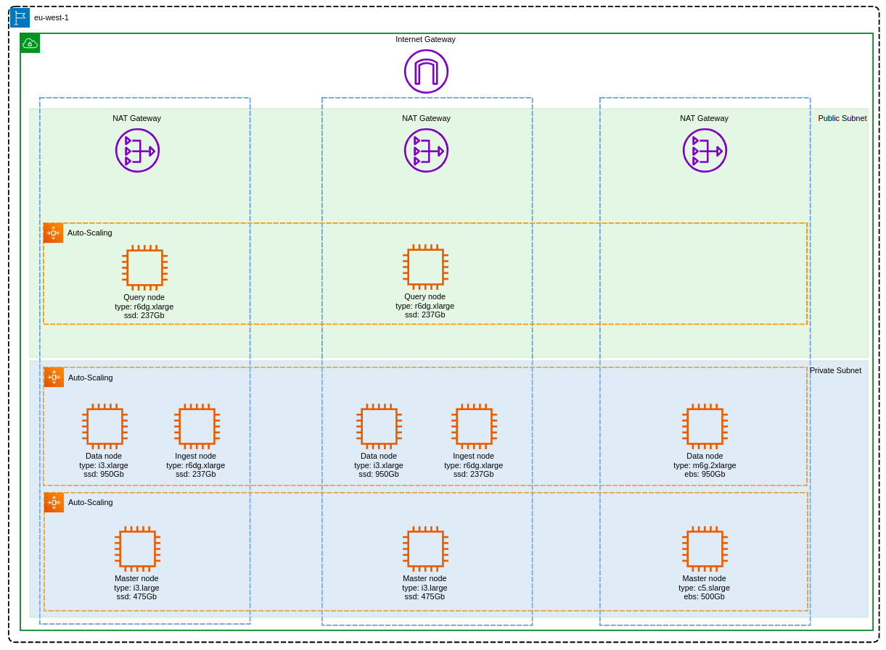

# Open Distro for Elasticsearch CloudFormation Templates

These templates create a full Open Distro for Elasticsearch cluster, including secure networking provided through VPC, configurable data nodes, master nodes, and client nodes. The client nodes provide also run Kibana server, providing Kibana access with a public IP  address.

## Template descriptions

The deployment uses CloudFormation's [nested stacks](https://docs.aws.amazon.com/AWSCloudFormation/latest/UserGuide/using-cfn-nested-stacks.html) to deploy a number of sub stacks. When complete, the architecture will look like this



## master.yml

This is the root stack, that you deploy directly via the CloudFormation console. It contains links to the other stacks that will create a VPC, create a seed node for bootstrapping an ES 7 cluster, create master nodes, create data nodes, and create a client node with a public IP address.

## templates/vpc-3azs.yml

Deploys an [Amazon VPC](https://aws.amazon.com/vpc/) to provide secure networking for the Open Distro for Elasticsearch cluster. The VPC spans 2 availability zones, with a public and a private subnet in each of those zones. The stack adds an Internet Gateway for outbound traffic and a NAT gateway for inbound traffic. EC2 instances in the public subnet can have public IP addresses; the seed node, and the client nodes are publicly accessible.

## templates/nodes/seed.yml

Deploys a single, seed instance at a known IP address that is the seed to bootstrap the Elasticsearch cluster.

## templates/nodes/data.yml

Deploys an auto scaled group of data nodes into the private subnet of the VPC

## templates/nodes/master.yml

Deploys an auto scaled group of master nodes. Initially it deploys 2 instances. The seed node remains in the cluster as the 3rd master.

## templates/nodes/client.yml

Deploys an auto scaled group of client nodes with public IP addresses in the public subnet of the VPC. These instances also join the cluster as client nodes. The client nodes run Kibana server.

# To use this stack

### Create an S3 bucket

\- Clone or download the repository.
\- Create an S3 bucket to hold the templates, in the region you want to deploy the stack.  You can use the AWS Console to create a bucket. Or, if you have [installed and configured the AWS Command Line Interface](https://docs.aws.amazon.com/cli/latest/userguide/cli-chap-install.html), you can run the command  

```aws s3 mb <your bucket> --region <desired region>```

### Deploy

There is a Makefile that takes several environment variables, which you can either set in the Makefile or pass it when deploying the stack, for example:

Add the `KeyName` pair to the `master.yml` file, then run:

```
profile=profile STAGE=prod REGION=region APP=app make deploy
```

### Testing

In the CloudFormation output, you will be able to retrieve the IP addresses for one of the client nodes and able to access this via the elastic api.

```
$ curl -XGET 'https://localhost:9200' -u 'admin:admin' --insecure
{
  "name" : "client-6785834e",
  "cluster_name" : "od4es",
  "cluster_uuid" : "F1KuSAX0Rtaixc7J9P28Mg",
  "version" : {
    "number" : "7.10.2",
    "build_flavor" : "oss",
    "build_type" : "rpm",
    "build_hash" : "747e1cc71def077253878a59143c1f785afa92b9",
    "build_date" : "2021-01-13T00:42:12.435326Z",
    "build_snapshot" : false,
    "lucene_version" : "8.7.0",
    "minimum_wire_compatibility_version" : "6.8.0",
    "minimum_index_compatibility_version" : "6.0.0-beta1"
  },
  "tagline" : "You Know, for Search"
}
```

```
$ curl -XGET 'https://localhost:9200/_cat/plugins?v' -u 'admin:admin' --insecure
name            component                       version
master-39b35c2b opendistro-alerting             1.13.1.0
master-39b35c2b opendistro-anomaly-detection    1.13.0.0
master-39b35c2b opendistro-asynchronous-search  1.13.0.1
master-39b35c2b opendistro-index-management     1.13.1.0
master-39b35c2b opendistro-job-scheduler        1.13.0.0
master-39b35c2b opendistro-knn                  1.13.0.0
master-39b35c2b opendistro-performance-analyzer 1.13.0.0
master-39b35c2b opendistro-reports-scheduler    1.13.0.0
master-39b35c2b opendistro-sql                  1.13.0.0
master-39b35c2b opendistro_security             1.13.1.0
data-67ecc4b4   opendistro-alerting             1.13.1.0
data-67ecc4b4   opendistro-anomaly-detection    1.13.0.0
data-67ecc4b4   opendistro-asynchronous-search  1.13.0.1
data-67ecc4b4   opendistro-index-management     1.13.1.0
data-67ecc4b4   opendistro-job-scheduler        1.13.0.0
data-67ecc4b4   opendistro-knn                  1.13.0.0
data-67ecc4b4   opendistro-performance-analyzer 1.13.0.0
data-67ecc4b4   opendistro-reports-scheduler    1.13.0.0
data-67ecc4b4   opendistro-sql                  1.13.0.0
data-67ecc4b4   opendistro_security             1.13.1.0
client-79364d85 opendistro-alerting             1.13.1.0
client-79364d85 opendistro-anomaly-detection    1.13.0.0
client-79364d85 opendistro-asynchronous-search  1.13.0.1
client-79364d85 opendistro-index-management     1.13.1.0
client-79364d85 opendistro-job-scheduler        1.13.0.0
client-79364d85 opendistro-knn                  1.13.0.0
client-79364d85 opendistro-performance-analyzer 1.13.0.0
client-79364d85 opendistro-reports-scheduler    1.13.0.0
client-79364d85 opendistro-sql                  1.13.0.0
client-79364d85 opendistro_security             1.13.1.0
data-61bc3cad   opendistro-alerting             1.13.1.0
data-61bc3cad   opendistro-anomaly-detection    1.13.0.0
data-61bc3cad   opendistro-asynchronous-search  1.13.0.1
data-61bc3cad   opendistro-index-management     1.13.1.0
data-61bc3cad   opendistro-job-scheduler        1.13.0.0
data-61bc3cad   opendistro-knn                  1.13.0.0
data-61bc3cad   opendistro-performance-analyzer 1.13.0.0
data-61bc3cad   opendistro-reports-scheduler    1.13.0.0
data-61bc3cad   opendistro-sql                  1.13.0.0
data-61bc3cad   opendistro_security             1.13.1.0
od4es-seed      opendistro-alerting             1.13.1.0
od4es-seed      opendistro-anomaly-detection    1.13.0.0
od4es-seed      opendistro-asynchronous-search  1.13.0.1
od4es-seed      opendistro-index-management     1.13.1.0
od4es-seed      opendistro-job-scheduler        1.13.0.0
od4es-seed      opendistro-knn                  1.13.0.0
od4es-seed      opendistro-performance-analyzer 1.13.0.0
od4es-seed      opendistro-reports-scheduler    1.13.0.0
od4es-seed      opendistro-sql                  1.13.0.0
od4es-seed      opendistro_security             1.13.1.0
client-6785834e opendistro-alerting             1.13.1.0
client-6785834e opendistro-anomaly-detection    1.13.0.0
client-6785834e opendistro-asynchronous-search  1.13.0.1
client-6785834e opendistro-index-management     1.13.1.0
client-6785834e opendistro-job-scheduler        1.13.0.0
client-6785834e opendistro-knn                  1.13.0.0
client-6785834e opendistro-performance-analyzer 1.13.0.0
client-6785834e opendistro-reports-scheduler    1.13.0.0
client-6785834e opendistro-sql                  1.13.0.0
client-6785834e opendistro_security             1.13.1.0
client-22ec7aeb opendistro-alerting             1.13.1.0
client-22ec7aeb opendistro-anomaly-detection    1.13.0.0
client-22ec7aeb opendistro-asynchronous-search  1.13.0.1
client-22ec7aeb opendistro-index-management     1.13.1.0
client-22ec7aeb opendistro-job-scheduler        1.13.0.0
client-22ec7aeb opendistro-knn                  1.13.0.0
client-22ec7aeb opendistro-performance-analyzer 1.13.0.0
client-22ec7aeb opendistro-reports-scheduler    1.13.0.0
client-22ec7aeb opendistro-sql                  1.13.0.0
client-22ec7aeb opendistro_security             1.13.1.0
master-ec2cd5bf opendistro-alerting             1.13.1.0
master-ec2cd5bf opendistro-anomaly-detection    1.13.0.0
master-ec2cd5bf opendistro-asynchronous-search  1.13.0.1
master-ec2cd5bf opendistro-index-management     1.13.1.0
master-ec2cd5bf opendistro-job-scheduler        1.13.0.0
master-ec2cd5bf opendistro-knn                  1.13.0.0
master-ec2cd5bf opendistro-performance-analyzer 1.13.0.0
master-ec2cd5bf opendistro-reports-scheduler    1.13.0.0
master-ec2cd5bf opendistro-sql                  1.13.0.0
master-ec2cd5bf opendistro_security             1.13.1.0
data-8a6ba07e   opendistro-alerting             1.13.1.0
data-8a6ba07e   opendistro-anomaly-detection    1.13.0.0
data-8a6ba07e   opendistro-asynchronous-search  1.13.0.1
data-8a6ba07e   opendistro-index-management     1.13.1.0
data-8a6ba07e   opendistro-job-scheduler        1.13.0.0
data-8a6ba07e   opendistro-knn                  1.13.0.0
data-8a6ba07e   opendistro-performance-analyzer 1.13.0.0
data-8a6ba07e   opendistro-reports-scheduler    1.13.0.0
data-8a6ba07e   opendistro-sql                  1.13.0.0
data-8a6ba07e   opendistro_security             1.13.1.0
master-26542ec3 opendistro-alerting             1.13.1.0
master-26542ec3 opendistro-anomaly-detection    1.13.0.0
master-26542ec3 opendistro-asynchronous-search  1.13.0.1
master-26542ec3 opendistro-index-management     1.13.1.0
master-26542ec3 opendistro-job-scheduler        1.13.0.0
master-26542ec3 opendistro-knn                  1.13.0.0
master-26542ec3 opendistro-performance-analyzer 1.13.0.0
master-26542ec3 opendistro-reports-scheduler    1.13.0.0
master-26542ec3 opendistro-sql                  1.13.0.0
master-26542ec3 opendistro_security             1.13.1.0
```

```
$ curl -XGET 'https://localhost:9200/_cat/nodes?v=true' -u 'admin:admin' --insecure

ip           heap.percent ram.percent cpu load_1m load_5m load_15m node.role master name
10.40.80.81            36          60   8    0.04    0.30     0.18 dir       -      data-8a6ba07e
10.40.5.117            54          74   2    0.16    0.06     0.07 r         -      client-22ec7aeb
10.40.0.101            28          63   3    0.43    0.21     0.24 dmr       *      od4es-seed
10.40.19.254            8          60   7    0.07    0.36     0.22 mr        -      master-ec2cd5bf
10.40.68.100           39          75   1    0.01    0.01     0.03 r         -      client-6785834e
10.40.85.218           28          60   7    0.05    0.41     0.26 mr        -      master-26542ec3
10.40.44.134           33          75   1    0.00    0.03     0.11 r         -      client-79364d85
10.40.61.245           63          60   6    0.06    0.36     0.21 mr        -      master-39b35c2b
10.40.61.182           12          60   8    0.08    1.01     0.72 dir       -      data-67ecc4b4
10.40.27.163           48          60   8    0.04    0.35     0.22 dir       -      data-61bc3cad
```

### Todo

- [x] Inital cluster
- [ ] Add an Application Load Balancer (ALB)
- [ ] Use a single node template

### Clean up

```
profile=profile STAGE=prod REGION=region APP=app make delete
```

### References

* https://github.com/widdix/aws-cf-templates